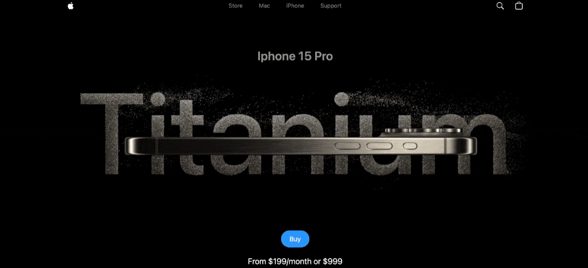
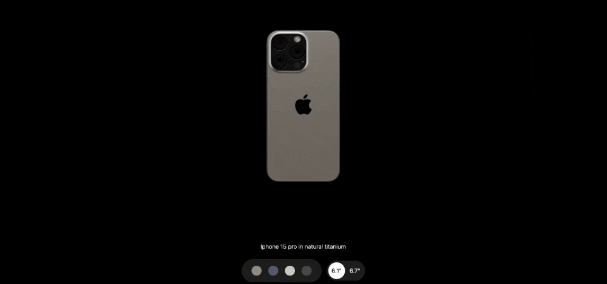

# Apple Dummy Site 🍎✨

This repository showcases a **dummy Apple website** built using cutting-edge web technologies, including **React**, **Three.js**, and **GSAP**. The project focuses on delivering an interactive and visually appealing experience inspired by Apple's design principles.

---

## 🚀 Features

### **1. Stunning 3D Visuals**
- Utilizes **Three.js** to create dynamic, real-time 3D graphics.
- Smooth object transformations and animations.

### **2. High-Performance Animations**
- Leveraging **GSAP (GreenSock Animation Platform)** for:
  - Seamless transitions and animations.
  - Interactive hover and scroll effects.
  - Advanced timeline-based animations.

### **3. Responsive Design**
- Optimized for desktop, tablet, and mobile devices.
- Ensures consistent user experience across all screen sizes.

### **4. Modular Architecture**
- Clean and reusable React components.
- Scalable structure for adding new features.

---

## 📚 What I Learned

1. **Three.js Basics**:
   - Setting up a 3D scene with cameras, lights, and objects.
   - Using geometries, materials, and textures for realistic visuals.

2. **GSAP Integration**:
   - Animating 3D objects and DOM elements.
   - Using GSAP's `ScrollTrigger` plugin for scroll-based interactions.

3. **React and Three.js**:
   - Integrating Three.js with React for reactive and dynamic rendering.
   - Managing 3D objects using `useRef` and `useEffect` hooks.

4. **Performance Optimization**:
   - Minimizing rendering overhead for smoother animations.
   - Using techniques like lazy loading and frustum culling.

---

## 🛠️ Tech Stack

- **Frontend**: React, HTML, CSS, JavaScript
- **3D Graphics**: Three.js
- **Animation Library**: GSAP (GreenSock Animation Platform)

---

## 🖼️ Screenshots

| **Feature**              | **Screenshot**                                   |
|--------------------------|-------------------------------------------------|
| Landing Page             |     |
| Highlight Section        |   |
| 3D Model                 |     |
| Hover Effects            |     |

---

## 📂 Project Structure

```
.  
├── public
│   └── index.html        # Entry HTML file
├── src
│   ├── components
│   │   ├── Navbar.jsx    # Navigation bar component
│   │   ├── Hero.jsx      # Hero section with 3D visuals
│   │   └── Footer.jsx    # Footer section
│   ├── pages
│   │   ├── Home.jsx      # Home page layout
│   │   └── About.jsx     # About page layout
│   ├── App.jsx           # Main app file
│   ├── index.css         # CSS styling
│   └── index.js          # React entry point
├── README.md             # Project README
└── package.json          # Project dependencies
```

---

## 📦 Installation

Follow these steps to run the project locally:

```bash
# 1. Clone the repository:
git clone https://github.com/Vijay-Keshvala/Appledummy.git

# 2. Navigate to the project directory:
cd Appledummy

# 3. Install dependencies:
npm install
npm install three
npm install gsap
npm install @gsap/scroll-trigger
npm install @gsap/react

# 4. Start the development server:
npm run dev
```

---

## 🔧 Usage

- Open the project in your browser at [http://localhost:5173](http://localhost:5173).
- Explore the interactive features and animations.
- Feel free to modify or extend the project to add your own customizations.

---

## 🌟 Acknowledgments

- [Three.js Documentation](https://threejs.org/docs/)
- [GSAP Official Documentation](https://greensock.com/docs/)
- [React Documentation](https://reactjs.org/docs/getting-started.html)

